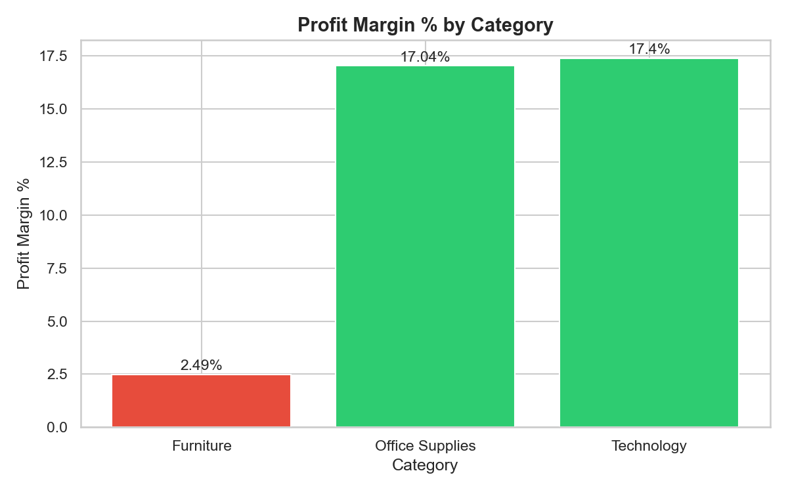
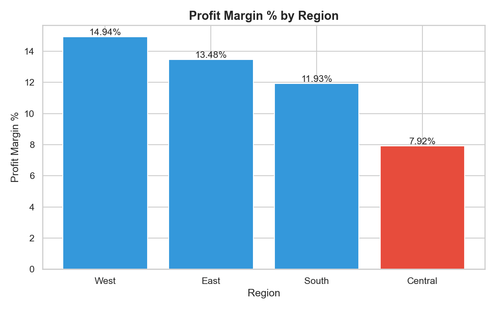
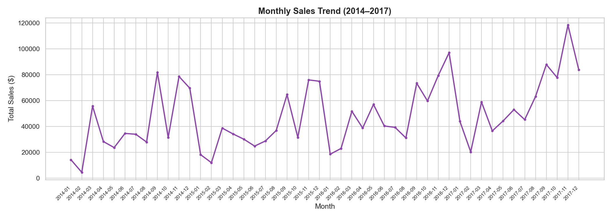
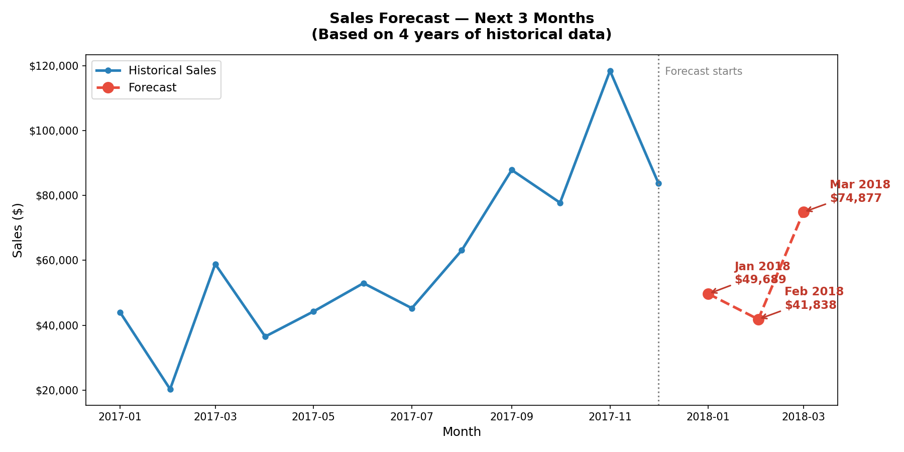

# Retail Sales Profitability Analysis

## Business Problem
A retail company generates $2.26M in revenue but only $286K in profit (12.7% margin).
The Sales Manager needs to know: where is profit being lost, and what decisions will fix it?

## Objective
Identify discount-driven profit losses, underperforming regions, and loss-making products —
and provide actionable recommendations to improve profitability.

## Target Stakeholder
Sales Manager / Business Head

## Key Business Decision Supported
Capping discounts above 20% would increase company profit by 47% — from $286K to $421K —
without changing headcount, products, or pricing strategy.

## Live Dashboard
[View Interactive Power BI Dashboard](https://app.powerbi.com/groups/me/reports/aba8a0e4-3815-496f-b4b6-e999f9cfbef9/65c3116e7be3c0d09289)

## Tools Used
- Python (pandas, matplotlib, seaborn)
- SQL (SQLite)
- Git / GitHub

## Key Findings
1. **Furniture has only 2.49% profit margin** vs 17% for Technology — caused by heavy discounting
2. **Central region underperforms** at 7.92% margin, nearly half of West region (14.94%)
3. **Sales spike every September, November, December** — consistent seasonal pattern across 4 years
4. **Canon imageCLASS 2200 Copier** is the star product — $25,199 profit from one SKU alone
5. **3D Printers are top loss-makers** — Cubify CubeX lost $8,879 in profit
6. **Orders with >20% discount have -37% profit margin** — destroying $135,376 in profit
7. **Capping discounts at 20% increases total profit by 47%** — from $286K to $421K
8. **Tables and Bookcases are loss-making sub-categories** — recommend repricing or discount removal

## Business Recommendations
| Problem | Recommendation | Expected Impact |
|---|---|---|
| High discounts on Furniture | Cap all discounts at 20% | +$135K profit |
| Central region underperformance | Audit discount policy in Central | Margin from 7.9% → 12%+ |
| Loss-making 3D Printers | Remove or reprice | Save $13K+ in losses |
| Seasonal spike unprepared | Launch promotions in August | Capture September demand early |

## Project Structure
├── 01_data_exploration.py   # Initial data understanding
├── 02_data_cleaning.py      # Data cleaning and feature engineering
├── 03_analysis.py           # Business insights and analysis
├── 04_charts.py             # Data visualizations
├── 05_sql_analysis.py       # SQL queries for deeper analysis
├── 06_business_decisions.py # Discount simulation and recommendations
└── README.md                # Project documentation
## Key SQL Queries
**Profit by Category:**
```sql
SELECT Category,
       ROUND(SUM(Profit) * 100.0 / SUM(Sales), 2) AS Profit_Margin_Pct
FROM orders
GROUP BY Category
ORDER BY Profit_Margin_Pct DESC
```

**Loss-making products:**
```sql
SELECT "Product Name",
       ROUND(SUM(Profit), 2) AS Total_Profit
FROM orders
GROUP BY "Product Name"
ORDER BY Total_Profit ASC
LIMIT 10
```

## Charts





## Sales Forecast
Using Exponential Smoothing on 4 years of historical data, predicted next 3 months of sales:
- January 2018: $49,689
- February 2018: $41,838
- March 2018: $74,877 (seasonal spike expected — consistent with historical March peaks)

**Business implication:** Marketing campaigns should be prepared by February to capture the March demand surge.